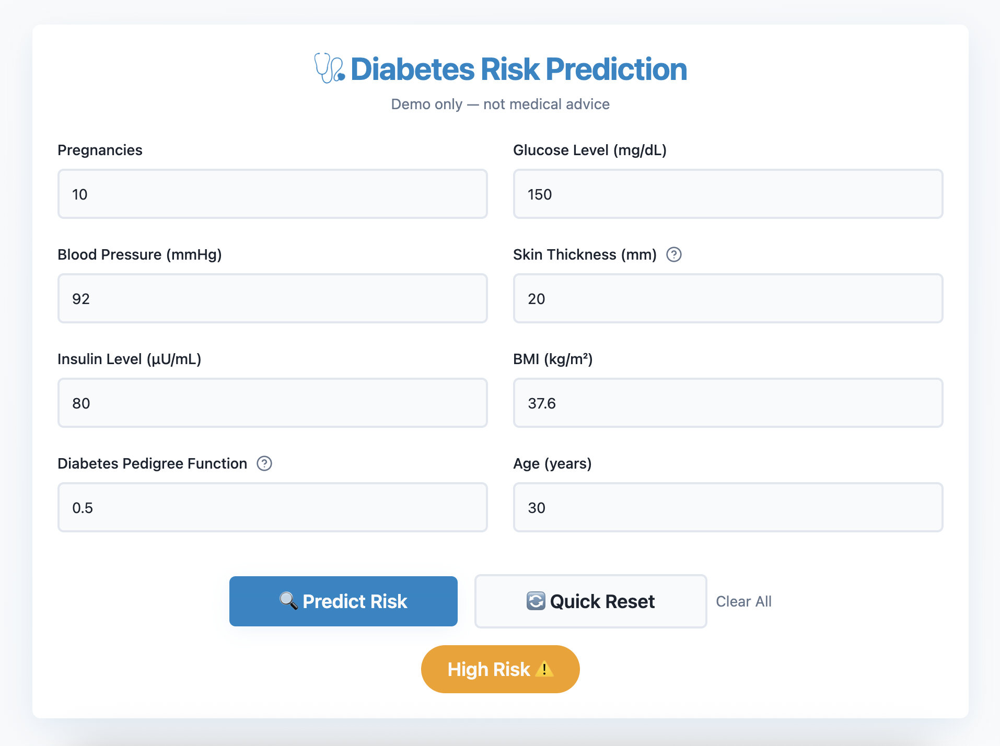

# 🩺 Diabetes Risk Prediction (ML + API + Cloud + UI) 


An end-to-end machine learning project that predicts risk of diabetes using the Pima Indians Diabetes dataset.  
Built with Python + scikit-learn, deployed as a FastAPI service on Render and connected to Lovable, an AI web tool frontend service for real-time risk screening. 

## 🚀 Project Overview
- **ML Model**: Support Vector Machine (SVM) trained on health indicators (glucose, BMI, age, etc).  
- **API**: FastAPI backend with endpoints to check health (`/health`) and make predictions (`/predict`).  
- **Cloud Deployment**: Hosted on [Render](https://render.com) with a public API.  
- **Frontend UI**: Built with Lovable that calls the API.
- **UX Enhancements:**: Tooltips explaining specific features (Diabetes Pedigree Function). **Quick reset** --> restores to default values + **Clear All** --> reset to blank to allow users to input specific values. Clear resault messages: **Low Risk ✅ or High Risk ⚠️**.

## ⚙️ Tech Stack
- **Python**: pandas, scikit-learn, numpy
- **FastAPI**: REST API framework
- **Render**: cloud deployment
- **Lovable**: AI frontend builder calling the API

## 📂 Repository Structure
```plaintext
diabetes-ml-api/
├── diabetes_clean.py   # Clean training script
├── diabetes_full.py    # Full/learning script 
├── main.py             # FastAPI app (/, /health, /predict)
├── diabetes_model.pkl  #Trained SVM model
├── scaler.pkl          # StandardScaler used for preprocessing
├── requirements.txt    # Python dependencies
├── README.md           # Project overview
└── screenshot.png      # UI screenshot

## 🔗 Live Demo
- **API:** https://diabetes-ml-api.onrender.com  
- **UI:** https://diabetes-risk-prediction.lovable.app
- Here’s what the UI looks like:


## ✨ Future Improvements 
Better feature handling for unknown values.
Auto-complete/Suggestions: Smart defaults based on age/gender demographics
Results History: Let users save and compare multiple predictions over time

## ⚠️ Disclaimer
This project is for educational/demo purposes only and not medical advice. Predictions are based on a model trained on a public dataset and may not reflect clinical reality.
